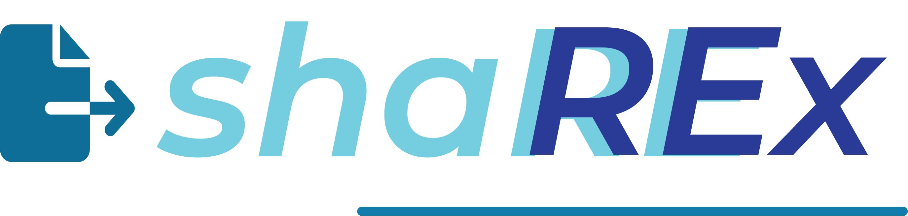
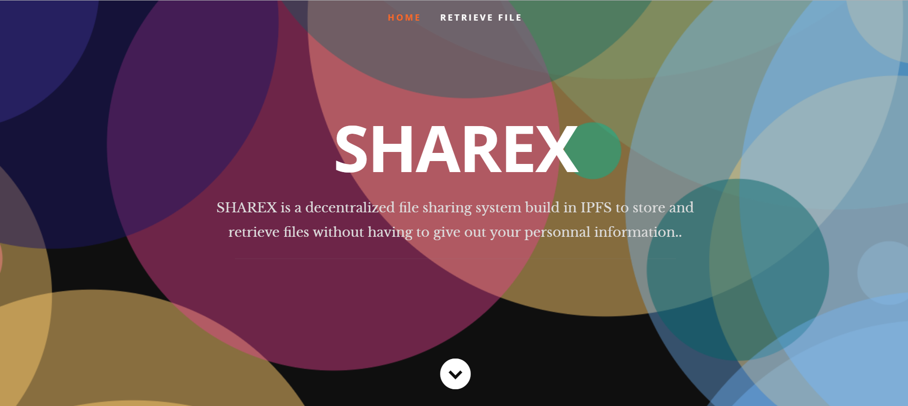

<!--Just Share It
     Blockchain based file sharing system-->
<a name="readme-top"></a>
<div align="center" >
     
     <h2>Share your file securely</h2>
     <p>A blockchain based file sharing system. </p>

<p>
  <a href="https://github.com/E-n-N-D/shaREx/graphs/contributors">
    
  </a>
  <a href="">
    
  </a>
  <a href="https://github.com/E-n-N-D/shaREx/network/members">
    
  </a>
  <a href="https://github.com/E-n-N-D/shaREx/stargazers">
    
  </a>
  <a href="https://github.com/E-n-N-D/shaREx/issues/">
    
  </a>
</p>

</div>

<br/>
<!--Table of Contents-->

# :notebook: Index 


- [Description](#open_book-Description)
- [Tools Used](#hammer-Tools-used)
- [Getting Started](#toolbox-Getting-started)
- [Deployment](#money_with_wings-Deployment)
- [Contacts](#telephone-Contacts)

<!--About this project-->


## :open_book: Description

Sharex is IPFS based file sharing system where a file is sent over the network via a link. The main idea behind Sharex is that you
can send file(any) from any device using browser via a link. The QR generated itself is a hash to the particular file that is to be sent over. 


## :hammer: Tools used

<ul>

<li> IPFS: InterPlanetary File System
</li>

<li> React.js: A JavaScript framework for UI development </p>

</ul>

<p align="right">(<a href="#readme-top">back to top</a>)</p>
<!--Getting Started-->

## :toolbox: Getting started
<p>
<ul>
<li>
To build this project, you have to have <a href= "https://nodejs.org/en/download/">node</a> installed in your pc. 
</li>
<li>
Clone the repo via following command.

```bash
cd folder-path-where-you-want-to-clone
git clone https://github.com/E-n-N-D/shaREx.git
```
</li>

<li>
Install the npm packages (To view the packages used, go to packages.json file )

 ```bash 
npm install
```
</li>
<li>
Build the project using the following command

```bash
npm start
```
</li>

</ul>
</p>


<p align="right">(<a href="#readme-top">back to top</a>)</p>

### :money_with_wings: Deployment


<p>
Sharex product: <a href = "">LINK HERE</a>
</p>

<p align="right">(<a href="#readme-top">back to top</a>)</p>


## :telephone: Contacts
<div>
<br>
 <a href="mailto:sushantadhikari2001@gmail.com">Sushant Adhikari</a><br>
 <a href="mailto:ankushniroulaa@gmail.com">Ankush Niroula</a><br>
 <a href="mailto:shubhechchhakp@gmail.com">Shubhechchhak Pokhrel </a><br>
 <a href="mailto:avyuthan364@gmail.com">Avyuthan Shah</a><br>
 <a href="mailto:sulavkarki8020@gmail.com">Sulav Karki</a><br>
</div>


<p align="right">(<a href="#readme-top">back to top</a>)</p>